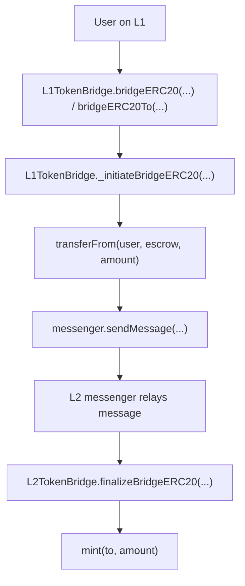
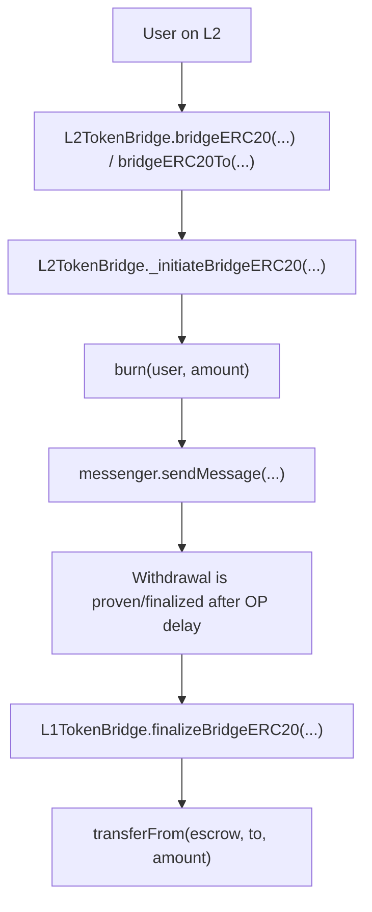

# Sky OP Token Bridge Local Review RU

Этот репозиторий - учебный local review моста MakerDAO / Sky OP Token Bridge.

Цель - понять архитектуру моста и основной token flow перед ручным Break Think анализом.

```text
Понять flow -> понять путь сообщения -> потом делать Break Think
```

Это не полный production audit. Это portfolio-style репозиторий для изучения bridge flow, escrow accounting, mint/burn логики, cross-chain messages и auth boundaries.

## Метод инвариантов

В этом репозитории инварианты разделены на две группы.

```text
Main Invariants = главные security rules bridge flow.
Additional Invariants / Checks = более мелкие function-level checks для понимания архитектуры.
```

Break Think в основном сфокусирован на Main Invariants.

Additional checks оставлены в объяснении flow, но они не являются главным фокусом ручного Break Think раздела.

Function code snippets основаны на:

```text
makerdao/op-token-bridge
```

## Модель моста

Этот bridge - custom bridge к OP Stack L2.

Главные контракты:

```text
L1TokenBridge.sol = L1 сторона моста
L2TokenBridge.sol = L2 сторона моста
Escrow.sol        = L1 token escrow
```

## Deposit Flow: L1 -> L2



Простой смысл:

```text
L1 tokens locked in Escrow.
L2 tokens minted to the recipient.
```

Главные deposit invariants:

```text
L1 escrowed amount must equal L2 minted amount.
Only an authentic L1 -> L2 message can mint L2 tokens.
The L1 token must map to the correct L2 token.
```

Additional deposit checks:

```text
The bridge must be open.
The recipient must be the intended recipient.
The message must target the correct L2 bridge.
```

## Withdrawal Flow: L2 -> L1



Простой смысл:

```text
L2 tokens are burned.
L1 tokens are released from Escrow.
```

Главные withdrawal invariants:

```text
L2 burned amount must equal L1 released amount.
Only an authentic L2 -> L1 message can release L1 tokens.
The L2 token must map to the correct L1 token.
```

Additional withdrawal checks:

```text
The bridge must be open.
The withdrawal amount must not exceed maxWithdraw.
The recipient must be the intended recipient.
```

## Core Functions Reviewed

### Deposit Functions

```text
L1TokenBridge.bridgeERC20(...)
L1TokenBridge.bridgeERC20To(...)
L1TokenBridge._initiateBridgeERC20(...)
L2TokenBridge.finalizeBridgeERC20(...)
```

### Withdrawal Functions

```text
L2TokenBridge.bridgeERC20(...)
L2TokenBridge.bridgeERC20To(...)
L2TokenBridge._initiateBridgeERC20(...)
L1TokenBridge.finalizeBridgeERC20(...)
```

### Admin / Escrow Functions

```text
Escrow.approve(...)
L1TokenBridge.registerToken(...)
L2TokenBridge.registerToken(...)
L2TokenBridge.setMaxWithdraw(...)
L1TokenBridge.close(...)
L2TokenBridge.close(...)
```

## Repository Structure

```text
sky-dai-fork-local-review-ru/
+-- README.md
+-- deposit-flow/
|   +-- 00-deposit-flow.md
|   +-- 01-l1-bridgeERC20.md
|   +-- 02-l1-initiateBridgeERC20.md
|   +-- 03-l2-finalizeBridgeERC20.md
+-- withdrawal-flow/
|   +-- 00-withdrawal-flow.md
|   +-- 01-l2-bridgeERC20.md
|   +-- 02-l2-initiateBridgeERC20.md
|   +-- 03-l1-finalizeBridgeERC20.md
+-- admin-flow/
|   +-- 01-escrow-approve.md
|   +-- 02-token-admin.md
+-- break-think/
    +-- README.md
    +-- deposit-break-think.md
    +-- withdrawal-break-think.md
    +-- admin-break-think.md
```

## Break Think

Папка `break-think/` оставлена для ручного анализа.

Формат:

```text
INVARIANT

CONSEQUENCES
```
