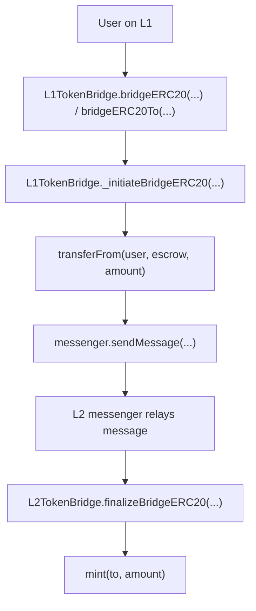
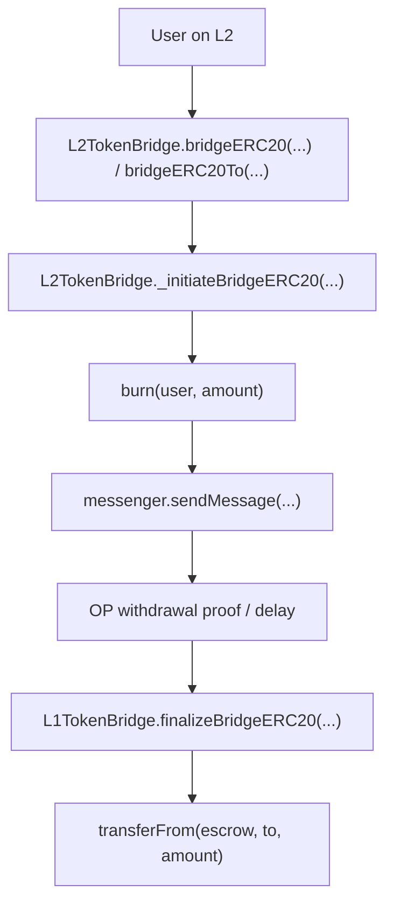

# Sky OP Token Bridge Local Review RU

Это русская версия учебного разбора MakerDAO / Sky OP Token Bridge.

Цель репозитория - понять bridge architecture и главный token flow перед ручным Break Think анализом.

```text
Понять flow -> понять message path -> сделать Break Think
```

Это не официальный аудит. Это portfolio-style репозиторий про bridge flow, escrow accounting, mint/burn logic, cross-chain messages и auth boundaries.

Исходный протокол:

```text
makerdao/op-token-bridge
```

## Модель моста

Это custom bridge для OP Stack L2.

Главные контракты:

```text
L1TokenBridge.sol = L1 сторона моста
L2TokenBridge.sol = L2 сторона моста
Escrow.sol        = L1 escrow для токенов
```

## Deposit Flow: L1 -> L2



Простой смысл:

```text
L1 tokens locked in Escrow = L2 tokens minted to recipient
```

## Withdrawal Flow: L2 -> L1



Простой смысл:

```text
L2 tokens burned = L1 tokens released from Escrow
```

## Main Invariants

Deposit:

```text
L1 escrowed amount must equal L2 minted amount.
Only an authentic L1 -> L2 message can mint L2 tokens.
The L1 token must map to the correct L2 token.
```

Withdrawal:

```text
L2 burned amount must equal L1 released amount.
Only an authentic L2 -> L1 message can release L1 tokens.
The L2 token must map to the correct L1 token.
```

Admin:

```text
Only authorized governance/admin can change bridge configuration.
```

## Структура

```text
sky-dai-fork-local-review-ru/
+-- README.md
+-- deposit-flow/
+-- withdrawal-flow/
+-- admin-flow/
+-- break-think/
```
